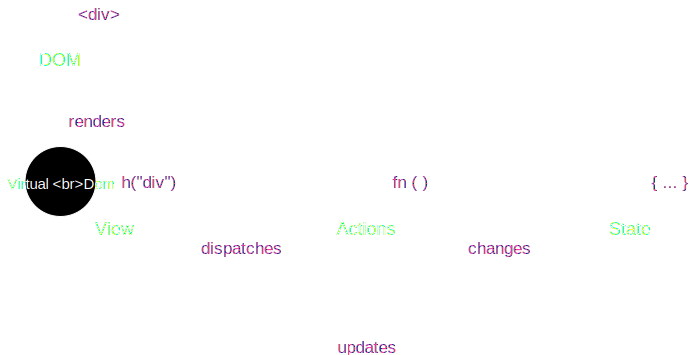

export { theme } from '../theme';

import { CodeSurfer } from "mdx-deck-code-surfer";

# Hyperapp  3.0

<blockquote cite="https://github.com/jorgebucaran/hyperapp">Hyperapp is a JavaScript micro-framework for building web interfaces.</blockquote>

---

## Features
- Small _(2.0.0-beta.12)_
    - ~1.8KB _(brotli compressed)_
    - ~4.1KB _(uncompressed)_
- Minimal
    - Immutable State
    - Unidirectional data-flow
- Declarative
    - JSX support
- Standalone
    - State management
    - Virtual DOM engine
    - Functional Components
    - View memoization

---

## Principles

- View
    - User interface
- State
    - Single state stree
- Actions
    - State transistions

---

## Architecture



---

## Getting started

### Usage as an ES-Module

```
npm i hyperapp@beta
```

```
import { h, app } from "hyperapp"
```

### "Old-school" via script-tag (_simplified_)

```html
<script src="https://unpkg.com/hyperapp@1.2.9/dist/hyperapp.js"></script>
<script>const {h, app} = window.Hyperapp;</script>
``` 

---

## Hello component

### Demo

---

## Defining the Hello component

<CodeSurfer
  title="hello.jsx"
  code={require("!raw-loader!./examples/hello-world/hello.jsx").default}
  lang="jsx"
  showNumbers={false}
  dark={true}
  steps={[
    { lines: [3], notes: "Template as JSX" },
    { lines: [1] , notes: "Always import the hypertext function"},
    { notes: "Boom 💥" }
  ]}
/>

--- 

## JSX & Hypertext

Kurz JSX und Hypertext erklären
Vorteile/Nachteile

Vielleicht in einer META-Slide generell Komponenten basiertes HTMl/JS erklären?
---

## Using the Hello component

<CodeSurfer
  title="index.js"
  code={require("!raw-loader!./examples/hello-world/index.jsx").default}
  lang="jsx"
  showNumbers={false}
  dark={true}
  steps={[
    { lines: [4], notes: "Import the component" },
    { lines: [6, 13] , notes: "Create a new Instance of the component"},
    { lines: [12] , notes: "Pass the DOM mounting point"},
    { range: [7, 11], notes: "Define the viewm, pass the properties"},
    { range: [3, 13], notes: "Profit! 🍾" }
  ]}
/>


