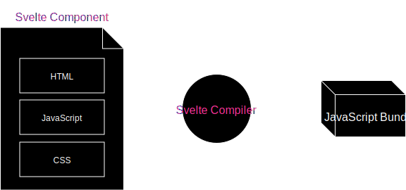

export { theme } from '../theme';

import { Split } from 'mdx-deck/layouts';
import { CodeSurfer } from "mdx-deck-code-surfer";

# Svelte 3.0

<blockquote cite="https://svelte.dev/">Cybernetically enhanced web apps</blockquote>

---

## Features

- Svelte = Compiler
- _No runtime_
- Truly reactive
- No virtual DOM
- Surgically updates the DOM
- Vanilla JS
- *fast* (faster than Angular, Ember, React, Mithrill, ...)

---

## Principles
- Declarative components (.svelte)
- JavaScript, HTML, CSS (scoped)
- Special syntax for reactive statements (labels)
- Svelte converts components into plain JavaScript

---

## Architecture



---

## Getting started
### Use the REPL (Read-eval-print loop)

https://svelte.dev/repl

---

## Getting started
### Use degit / svelte-template
```console
npx degit sveltejs/template my-svelte-project
cd my-svelte-project
npm install
npm run dev
```
---

## Getting started
### Use a bundler 
- rollup (https://github.com/rollup/rollup-plugin-svelte)
- webpack (https://github.com/sveltejs/svelte-loader)

---

## Hello component

### Demo

---

<CodeSurfer
  title="Defining the component - hello.svelte"
  code={require("!raw-loader!./examples/hello-world/hello.svelte").default}
  lang="javascript"
  showNumbers={false}
  dark={true}
  steps={[
    { lines: [5], notes: "Basic template" },
    { range: [1, 3] , notes: "Define external properties"},
    { notes: "Hello World" }
  ]}
/>

---

<CodeSurfer
  title="Using the component - index.js"
  code={require("!raw-loader!./examples/hello-world/index.js").default}
  lang="javascript"
  showNumbers={false}
  dark={true}
  steps={[
    { lines: [3], notes: "Import the component" },
    { lines: [5, 8] , notes: "Create a new Instance of the component"},
    { lines: [6, 7] , notes: "Pass the DOM mounting point"},
    { range: [3, 8], notes: "Profit! 🍾" }
  ]}
/>

---

## Reactive declarations

- like spreadsheets (excel)
- uses "special" label syntax

---

<CodeSurfer
  title="Reactive declarations"
  code={require("!raw-loader!./examples/reactive.js").default}
  lang="javascript"
  showNumbers={false}
  dark={true}
  steps={[
        { range: [1, 4], notes: "Dependent variables" },
        { range: [1, 6], notes: "No reactive updates" },
        { tokens : { 10: [0, 1] }, notes: "Sveltes uses labels..." },
        { lines: [10], notes: "...for reactive declarations"},
        { range: [8, 12], notes: "✨ Magic! ✨" }
  ]}
/>

---

## Todo-List

### Demo

---

<CodeSurfer
  title="TodoList.svelte"
  code={require("!raw-loader!./examples/todo-list/TodoList.svelte").default}
  lang="javascript"
  showNumbers={true}
  dark={true}
  steps={[
        { range: [4, 6], notes: "Defining external properties" },
        { range: [8, 9], notes: "Reactive variables" },
        { ranges : [[15, 19], [23, 27]], notes: "Each blocks" },
        { notes: "That's it!" }
  ]}
/>

---

## Stores

* like Redux, vuex, etc. but simplified
* usage across components without __prop-drilling__
* subscribe/unsubscribe methods
* always unsubscribe to avoid memory leaks
* prefix $ automates subscription

### Store types
* __writable__: store can be altered
* __readable__: can't be modified outside init-function
* __derived__: derived from another store

---

## Lifecycle events

* like Angular or React lifecycle hooks (onInit, componentDidMount,...)

### Methods
* __onMount__: runs when the component is mounted to the DOM
* __onDestroy__: runs when the component is unmounted
* __beforeUpdate__: runs before any state change
* __afterUpdate__: runs after any state change

---

## Counter

### Demo

---

<CodeSurfer
  title="Counter.svelte"
  code={require("!raw-loader!./examples/counter/Counter.svelte").default}
  lang="javascript"
  showNumbers={true}
  dark={true}
  steps={[
        { range: [24, 27], notes: "Mutiple components sharing one store" },
        { lines: [3], notes: "The store is imported" },
        { lines: [3, 23], notes: "The store can be used in the template" },
        { lines: [13], notes: "Updating the store" },
        { lines: [2, 11, 15, 17, 19], notes: "Using lifecycle methods" },
        { notes: "All together" }
  ]}
/>

---

<CodeSurfer
  title="store.js"
  code={require("!raw-loader!./examples/counter/store.js").default}
  lang="javascript"
  showNumbers={false}
  dark={true}
  steps={[
        {notes: "Writable store initialization" },
  ]}
/>

---

<CodeSurfer
  title="Progress.svelte"
  code={require("!raw-loader!./examples/counter/Progress.svelte").default}
  lang="html"
  showNumbers={true}
  dark={true}
  steps={[
        {lines: [3], notes: "Importing the store" },
        {lines: [2, 5], notes: "Creating a second, derived store" },
        {lines: [17], notes: "Using the derived store" },
  ]}
/>

---

## What else?

* Events
* Bindings
* Slots
* svelte/motion
* svelte/transition
* svelte/animate

---

## When to use svelte?

### When you have
  * time to learn the syntax
  * full control of the build-process

---

## When to use svelte?  

### When you need/want
  * small widgets, micro-apps
  * reactive behaviour (calculations, editors, ...)
  * minimal filesizes